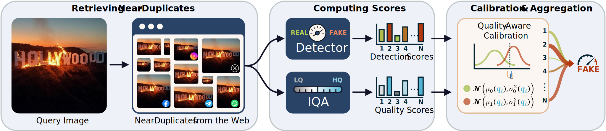
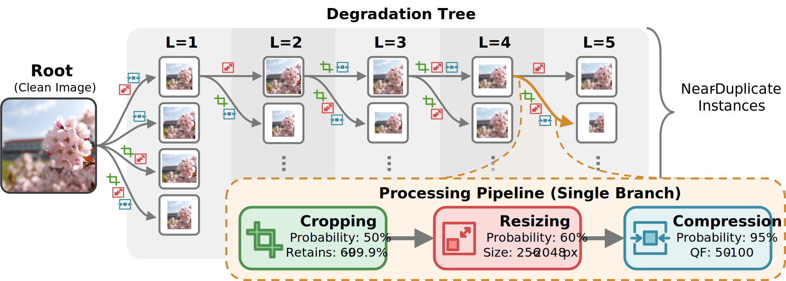
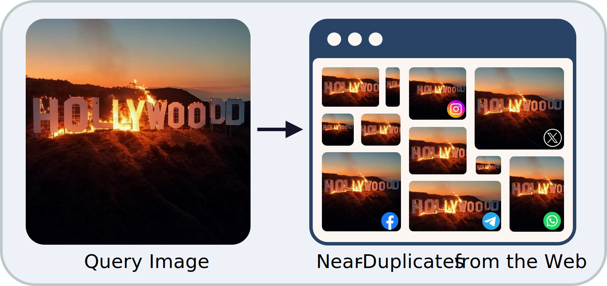

<center>
 
</center>


Most existing forensic tools operate on a single image instance, overlooking a key characteristic of real-world dissemination: as viral images circulate online, multiple *near-duplicate* versions appear and lose quality due to repeated operations like recompression, resizing and cropping. 
As a consequence, the same image may yield inconsistent forensic predictions based on which version is analyzed.

**QuAD (Quality-Aware calibration with near-Duplicates)** is a framework specifically designed to improve the detection of viral AI-generated images circulating across the web.
It makes decisions based on all available near-duplicate versions of the same query image, aggregating calibrated scores across near-duplicates and weighting each version's contribution by its estimated quality.
By doing so, we take advantage of all pieces of information while accounting for the reduced reliability
of images impaired by multiple processing steps.

More specifically, given a query image, we first retrieve near-duplicate versions from the web, which often differ in quality due to re-posting operations. We then run a forensic detector on each version to obtain detection scores and use an off-the-shelf no-reference Image Quality Assessment (IQA) module to estimate their quality. Finally, we perform quality-aware calibration and aggregate the weighted scores across all the near-duplicate versions.

To support large-scale evaluation, we also introduce two datasets: **AncesTree**, an in-lab dataset of 136k images organized in stochastic degradation trees that simulate online reposting dynamics, and **ReWIND**, a real-world dataset of nearly 10k near-duplicate images collected from viral web content.

## Quality-aware calibration

We guide the calibration using the estimated image quality. In this way, **higher quality versions of the image have a higher influence on the final decision**, while less reliable scores have a smaller contribution.

We model the behavior of the logit score $l_i$ of a near-duplicate instance as a function of the no-reference quality index $q_i$ using a **Gaussian fitting** separately for real and fake images:

$$l_i \mid q_i, y=1 \sim \mathcal{N}(\mu_1(q_i), \sigma_1^2(q_i))$$
$$l_i \mid q_i, y=0 \sim \mathcal{N}(\mu_0(q_i), \sigma_0^2(q_i))$$

In other words, for each instance we have two gaussians that depend on $q_i$.
For low-quality instances, Gaussians are expected to be closer and overlap more, resulting in a corrected logit score closer to zero and consequently reducing its contribution to the final sum.

We then compute the calibrated logit score $\hat{l}_i$ of the instance as:

$$\hat{l}_i = \frac{(l_i - \mu_0(q_i))^2}{2\sigma_0^2(q_i)} -\frac{(l_i - \mu_1(q_i))^2}{2\sigma_1^2(q_i)} +  \log\left(\frac{\sigma_o(q_i)}{\sigma_1(q_i)}\right)$$

For a query image, the final score is obtained by summing the calibrated logits of its near-duplicates. The resulting decision rule is:

$$\sum_{i=1}^N \hat{l}_i  > 0$$

 
## AncesTree Dataset

<center>  </center>

***AncesTree*** is a tree of progressive degradations used to generate near-duplicate image instances. Starting from a clean image (from the source dataset of real/fake images), multiple degradation operations are applied across levels (L = 1 to L = 5). Each branch represents a sequential processing pipeline consisting of random cropping, resizing, and compression for a total of 124 near-duplicate samples for each image.
The total number of near-duplicates is 136,400.

The dataset is available [here](https://github.com/grip-unina/QuAD/blob/main/datasets/AncesTree/).


## ReWIND Dataset

<center>  </center>

***ReWIND*** is a collection of in-the-wild real and AI-generated images that were shared on-line and became viral on social networks. The widespread circulation of these images allowed us to scrape the web to find multiple instances (*near-duplicates*) of each source image with different and unknown degradations.
The dataset contains 162 sources (87 real / 75 fake) with at least 10 near-duplicates, for a total of 9646 instances in different formats (JPEG, WebP and PNG).

The dataset is available [here](https://github.com/grip-unina/QuAD/blob/main/datasets/ReWIND/).


## Results

<center>  </center>

The left panel of the figure illustrates the effect in terms of balanced Accuracy of different ranking by quality factor, image size, and IQA scores (TReS, QCN, LoDa). All the ranking curves converge to the same point (gray star), which coincides with the naive aggregation of all 124 instances. The **orange ⋆** represents the accuracy of **QuAD**, our proposed calibrated aggregation of all 124 instances.
It is clear that the compression quality factor and especially the image dimensions are not reliable as a ranking metric. In fact, there is no guarantee that the largest image has not been heavily processed before a final upscaling.

The right panel shows the performance in the setting where not all near-duplicates are available.
The orange curve represents **QuAD**, while the gray curve corresponds to a simple aggregation of all the available instances and the blue curve aggregates only the 10 best instances according to the LoDA IQA method. Even in this situation the proposed calibrated aggregation works well with the few examples available.


## Bibtex

 ```
@inproceedings{Guillaro2026quality,
  title={Quality-Aware Calibration for AI-Generated Image Detection in the Wild},
  author={Guillaro, Fabrizio and De Rosa, Vincenzo and Cozzolino, Davide and Verdoliva, Luisa},
  booktitle={IEEE/CVF conference on Computer Vision and Pattern Recognition (CVPR) Workshops},
  year={2026}
}
```

## Acknowledgments

We gratefully acknowledge the support of this research by a Google Gift. \
We would also like to thank Avneesh Sud and Ben Usman for useful discussions.


